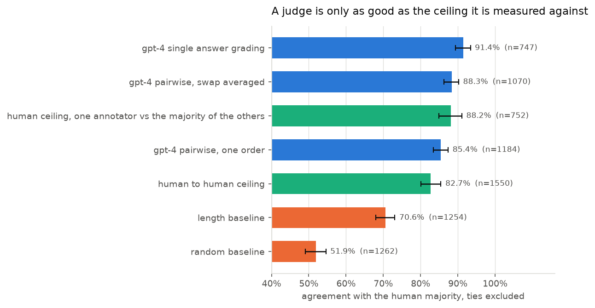
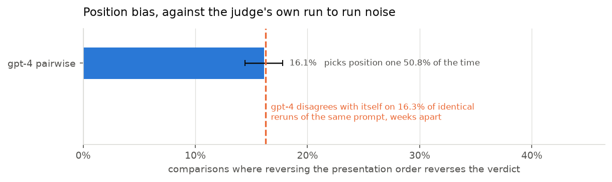
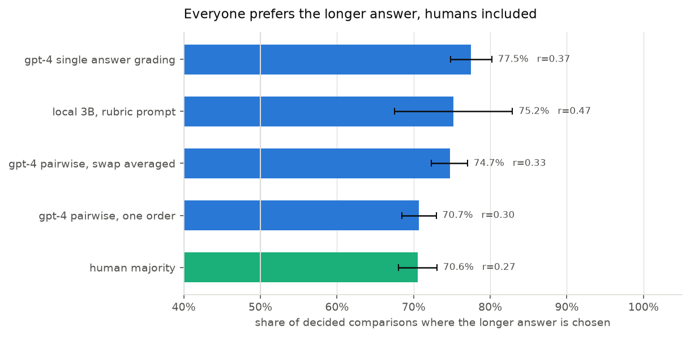
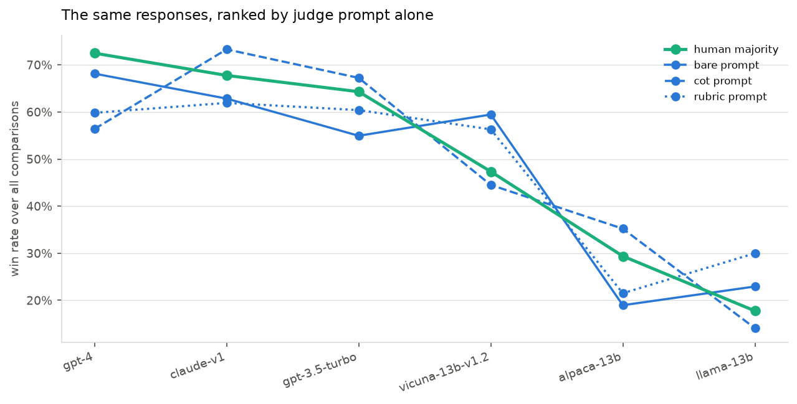
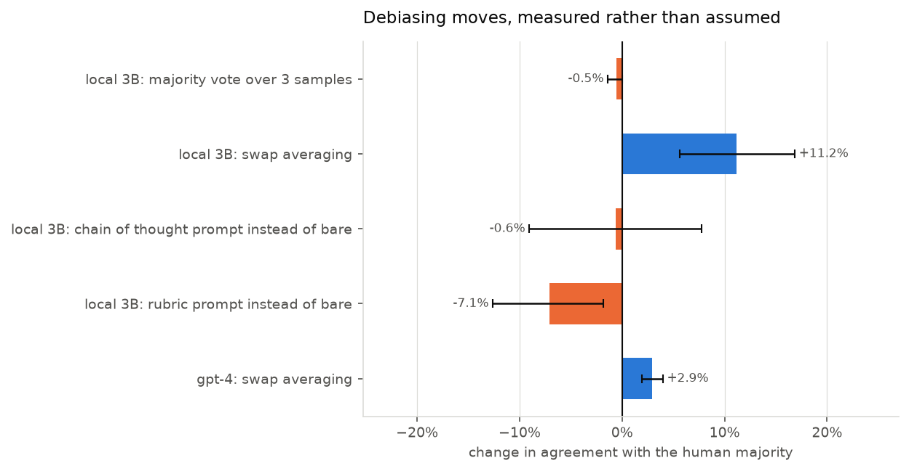
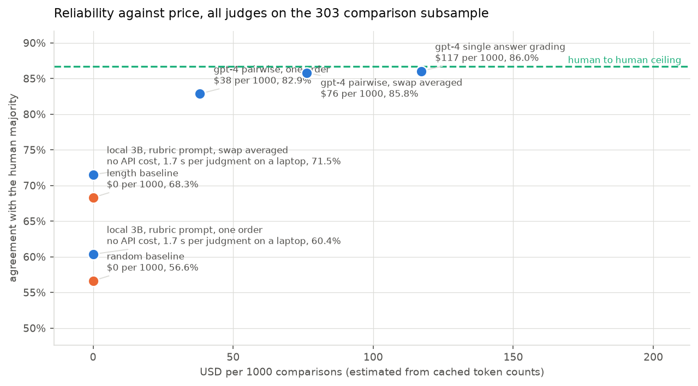

# judge-reliability

**Across 1814 human labelled MT-Bench comparisons, GPT-4 judging a
pair of answers agrees with the human majority 85.5 percent of the time,
against a human ceiling of 88.2 percent and a length only baseline that
reaches 70.6 percent. Reversing the order the two answers are shown in
flips the verdict on 16.1 percent of comparisons, and swap averaging
recovers 2.9 points of agreement, which closes the gap to that ceiling.**

The judge is good. It is also not better than a careful human, it is only
14.9 points better than a rule that reads none
of the text and always picks the longer answer, and its order sensitivity turns out to
be indistinguishable from its own run to run noise. Those three facts are the reason to
measure a judge rather than assume one.



## What this is

An LLM-as-judge is a measurement instrument, and nobody ships an instrument
without calibrating it. This repo calibrates one: agreement with human
preferences against the human to human ceiling, position bias, verbosity bias,
self preference, prompt sensitivity, cost, and which debiasing mitigations
actually recover accuracy rather than merely sounding sensible.

Every number below is regenerated by `make all` from cached judgments. No API
key, no model call, no network beyond the initial public data download.

## The data

- **1814 comparisons** from `lmsys/mt_bench_human_judgments`, CC BY 4.0:
  3355 individual votes from 65 annotators over
  80 MT-Bench questions and 6 models
  (alpaca-13b, claude-v1, gpt-3.5-turbo, gpt-4, llama-13b, vicuna-13b-v1.2), first and second conversation turns.
- **Human labels**: the annotator majority names a winner on
  1262
  comparisons and ties on 552.
  961 comparisons have two or more annotators,
  which is what makes a ceiling possible.
- **Judges**: GPT-4 (0613) pairwise in both presentation orders and GPT-4 single answer
  grading, both from the judgments LMSYS released with MT-Bench, plus a local
  Qwen2.5 3B judge run here on a laptop over a seeded subsample of 303 of them, plus two
  non LLM baselines: always prefer the longer answer, and a coin flip.

## 1. Agreement, and the ceiling that gives it meaning

Ties excluded on both sides, which is the standard setup and the only one where a
judge, a human and a coin flip are comparable. `comparisons scored` is how many
of the 1814 survive that restriction for each configuration:
a judge that abstains more is scored on fewer and easier comparisons.

| configuration | agreement | 95 percent CI | comparisons scored |
| --- | --- | --- | --- |
| gpt-4 single answer grading | 91.5 | 89.4 to 93.4 | 752 |
| gpt-4 pairwise, swap averaged | 88.4 | 86.4 to 90.3 | 1078 |
| human ceiling, one annotator vs the majority of the others | 88.2 | 85.0 to 91.1 | 752 |
| gpt-4 pairwise, one order | 85.5 | 83.5 to 87.5 | 1192 |
| human to human ceiling | 82.7 | 80.0 to 85.5 | 1550 |
| local 3B, rubric prompt, swap averaged | 71.5 | 63.6 to 79.0 | 130 |
| length baseline | 70.6 | 68.0 to 73.1 | 1254 |
| local 3B, bare prompt, one order | 67.5 | 61.1 to 73.6 | 212 |
| local 3B, cot prompt, one order | 66.9 | 59.8 to 73.9 | 175 |
| local 3B, rubric prompt, one order | 60.4 | 53.9 to 66.8 | 222 |
| random baseline | 51.9 | 49.1 to 54.6 | 1262 |

Two ceilings, because the obvious one is unfair to humans. Annotator against
annotator is 82.7 percent, which is what people usually quote.
But a judge is scored against the *majority* of several annotators, a denoised
label, so the like for like number is one annotator against the majority of the
others: 88.2 percent (85.0 to 91.1). Quote the first and GPT-4
looks superhuman. Quote the second and it lands 2.7
points short, and swap averaging closes that gap.

Cohen's kappa tells the same story with the chance agreement taken out:
0.47 for GPT-4 against
0.24 for the length rule and
0.02 for the coin. Krippendorff's alpha
over the 65 human annotators is
0.485; adding GPT-4 to the annotator pool moves it to
0.477. On this evidence GPT-4 is about as
agreeable as one more human annotator, no more and no less.

Same table, ties kept and counted as a third label:

| configuration | agreement | 95 percent CI | comparisons scored |
| --- | --- | --- | --- |
| gpt-4 single answer grading | 68.1 | 65.5 to 70.7 | 1229 |
| gpt-4 pairwise, swap averaged | 67.3 | 65.2 to 69.5 | 1814 |
| human to human ceiling | 65.5 | 62.7 to 68.5 | 2368 |
| gpt-4 pairwise, one order | 65.0 | 62.8 to 67.3 | 1814 |
| human ceiling, one annotator vs the majority of the others | 64.9 | 60.8 to 68.9 | 1380 |
| local 3B, bare prompt, one order | 50.2 | 44.6 to 55.8 | 303 |
| length baseline | 49.9 | 47.6 to 52.3 | 1814 |
| local 3B, cot prompt, one order | 48.6 | 42.4 to 54.9 | 247 |
| local 3B, rubric prompt, one order | 44.7 | 39.3 to 50.3 | 302 |
| local 3B, rubric prompt, swap averaged | 41.4 | 35.8 to 46.9 | 302 |
| random baseline | 36.1 | 33.9 to 38.3 | 1814 |

## 2. Position bias, next to the judge's own noise

Every comparison is judged twice, once in each order.



- Order reversal flips the verdict on **16.1 percent**
  (14.4 to 17.8) of 1814 comparisons.
- There is **no directional preference**: across
  3177 decided presentations the judge picks whichever
  answer was shown first 50.7 percent of the time. A coin does
  that. The bias is instability, not a thumb on the first position.
- GPT-4 single answer grading has no position bias at all, because it never sees
  the two answers together.

The number that puts the flip rate in perspective: 1356 of these
judgments exist twice in the released files, same prompt, same model, runs weeks
apart. GPT-4 agrees with itself on 83.8 percent of them, so it
**disagrees with itself 16.2 percent of the time with nothing
changed at all**. The 16.1 percent flip rate under order reversal is the
same size. Whatever swap averaging is buying here, it is variance reduction, not the
removal of a directional bias.

## 3. Verbosity



GPT-4 picks the longer answer 70.5 percent of the time
(r = 0.29 between its choice and the length
difference). The humans pick the longer answer 70.6 percent of
the time (r = 0.27). Those are the same number.

This is the finding people get backwards. The judge's correlation with length is
not by itself evidence of bias, because on this data longer answers really are
better and humans prefer them at the same rate. What it does establish is how low
the bar is: a rule that reads none of the text and always picks the longer answer
already agrees with humans 70.6 percent of the time, against a coin flip's
51.9 percent. Roughly 83 percent of what a
frontier judge achieves is achievable by counting characters.

The controlled version holds quality fixed: pad the shorter answer with content
free filler until it is half again as long as the longer one, and see whether the
verdict moves. On 259 comparisons where the local judge preferred the other
answer before padding, it moved to the padded answer
**3.1 percent** of the time (1.2 to 5.4).

## 4. Self preference

GPT-4 judging comparisons that include a GPT-4 response, against how the same
humans scored the same comparisons:

| | judge win rate for the family | human win rate | gap | 95 percent CI | comparisons |
| --- | --- | --- | --- | --- | --- |
| gpt-4 judging gpt-4 | 85.2 | 72.5 | +12.7 | 9.5 to 16.0 | 578 |
| gpt-4 judging claude-v1 (control) | 71.6 | 67.8 | +3.9 | 0.8 to 7.0 | 594 |

GPT-4 rates its own family 12.7 points higher than the humans
do, more than three times the gap it shows for a family it has no stake in. The
interval excludes zero. It is a real effect on 578 comparisons, and it is
still one judge, one response set and one point in time, so read
`LIMITATIONS.md` before quoting it. It cannot be separated here from stylistic
kinship: GPT-4 may simply favour answers that look like its own.

## 5. Prompt sensitivity

The judge prompt is a free parameter that teams pick by taste. Here are three,
identical except for scaffolding, run by the same local Qwen2.5 3B model over the
same 303 comparisons in both orders: a bare instruction, a
rubric that spells out criteria and explicitly warns against rewarding length or
position, and a chain of thought prompt that reasons before committing.



| judge prompt | agreement | 95 percent CI | comparisons scored |
| --- | --- | --- | --- |
| bare | 67.5 | 61.1 to 73.6 | 212 |
| cot | 66.9 | 59.8 to 73.9 | 175 |
| rubric | 60.4 | 53.9 to 66.8 | 222 |

**Changing nothing but the judge prompt moves the model at the top of the
leaderboard.** Over the same responses and the same comparisons, the bare prompt picks gpt-4, the cot prompt picks claude-v1, the rubric prompt picks claude-v1. The
humans on these comparisons pick gpt-4. Kendall tau against the human
ranking: bare 0.73, cot 0.73, rubric 0.60.

Agreement moves 7.1 points across the three
prompts, from 60.4 for the rubric prompt to
67.5 for the bare prompt. The direction is the
surprise: the rubric is the prompt that tells the judge in as many words not to
reward length or position, and it is the worst of the three. Scaffolding that
sounds like it should help is exactly the kind of thing that has to be measured.

For scale, on this same pool of 303 comparisons GPT-4
scores 82.9 (n=216 after ties are excluded) and the
length rule scores 68.3 (n=224).
Every prompt variant of the 3B judge sits at or below the length rule. What the
local judge contributes is not accuracy, it is that it is cheap enough to run
under every prompt variant, which is the experiment a team needs before trusting
any leaderboard a judge produces.

## 6. Mitigations, measured rather than assumed



| mitigation | before | after | change | 95 percent CI | comparisons scored before and after |
| --- | --- | --- | --- | --- | --- |
| gpt-4: swap averaging | 85.5 | 88.4 | +2.9 | 1.9 to 4.0 | 66 percent to 59 percent |
| local 3B: rubric prompt instead of bare | 67.5 | 60.4 | -7.1 | -12.6 to -1.8 | 70 percent to 73 percent |
| local 3B: chain of thought prompt instead of bare | 67.5 | 66.9 | -0.6 | -9.1 to 7.8 | 70 percent to 58 percent |
| local 3B: swap averaging | 60.4 | 71.5 | +11.2 | 5.6 to 16.9 | 73 percent to 43 percent |
| local 3B: majority vote over 3 samples | 60.4 | 59.8 | -0.5 | -1.4 to 0.0 | 73 percent to 74 percent |

Swap averaging is the one that works, and it is not free: it doubles the number
of model calls and it converts every order disagreement into a tie, so coverage
drops from 66 percent of comparisons to
59 percent. You are buying accuracy with abstention as
much as with debiasing, which is fine as long as you know that is the trade.

## 7. Cost against reliability



Every point in that figure is measured on one pool of comparisons, the subsample
the local judge ran on, so the accuracies there are not the full set accuracies
in the table above. Mixing the two pools on one axis would compare different
samples as though they were the same one.

| judge | mean input tokens | mean output tokens | USD per 1000 judgments | median latency |
| --- | --- | --- | --- | --- |
| gpt-4-0613-pair | 979 | 147 | 38.18 (estimated) | not recorded |
| gpt-4-0613-single | 1253 | 350 | 58.61 (estimated) | not recorded |
| qwen2.5-3b-4bit-local | 927 | 51 | 0.00 | 1.69 s |

Token counts for the released GPT-4 judgments are estimated from character
counts and priced at gpt-4-0613 list prices, so treat that column as an order of
magnitude. Swap averaging doubles it.

## The unflattering findings, in one place

1. **Order sensitivity is not a bias, it is noise.** GPT-4 flips on
   16.1 percent of comparisons when the order is reversed, and disagrees
   with itself on 16.2 percent of identical reruns. There is no
   directional preference for position one to remove
   (50.7 percent, which is a coin). Swap averaging helps because
   averaging two noisy draws helps.
2. **The length baseline is closer than it should be.** Always preferring the
   longer answer agrees with humans 70.6 percent of the time, reaching
   83 percent of what GPT-4 achieves while reading
   none of the text. Any judge evaluation without this baseline in it is not
   telling you what the judge contributes.
3. **The judge is not better than a person.** 85.5 percent against a like
   for like human ceiling of 88.2 percent. The commonly quoted comparison,
   against raw annotator to annotator agreement of 82.7 percent, makes
   the judge look superhuman and is the wrong comparison.
4. **The judge is partial to itself**, by 12.7 points against
   the human labels on 578 comparisons, more than three times the gap for a
   family it has no stake in.
5. **The best scoring configuration scores best partly by abstaining.** GPT-4
   single answer grading reaches 91.5 percent, the highest number in
   the repo, on 752 comparisons rather than 1192. Read coverage
   next to accuracy or that number is a mirage.
6. **No prompt variant of the small local judge beats the length baseline.** Its
   best prompt reaches 67.5 percent on the subsample where the length
   rule reaches 68.3 percent. Only after swap averaging does it edge
   past, to 71.5 percent on 130 comparisons rather
   than 212. On this evidence a 3B judge on these comparisons is mostly
   measuring verbosity and noise, and should not be shipped as an evaluator.
7. **Chain of thought made the local judge less stable, not more.** Under the
   cot prompt the verdict reverses on
   53.1 percent of comparisons when the order is reversed, worse than a coin, and it is the one prompt with a real thumb on the
   scale: it picks whichever answer came first
   61.7 percent of the time. Reasoning traces are not free
   reliability.
8. **The rubric that warns against length and position bias made agreement
   worse.** Swapping the bare prompt for the rubric costs the local judge
   7.1 points, interval excluding zero. Telling a judge not to be biased is not a
   mitigation until it has been measured as one.

## Reproduce

```bash
pip install -r requirements.txt
make all
```

`make all` downloads the public data, audits it, rebuilds the comparison table,
loads the released GPT-4 judgments into the cache, runs the tests, and rewrites
every number above. `make analysis` on its own does everything from the committed
cache with no network at all.

**No number in this README is typed by hand.** Every one of them is written by
`07_report.py` out of `output/metrics.json`, so a result cannot drift from the
data by being edited in one place and not the other. `LIMITATIONS.md` and
`DECISIONS.md` are prose and do quote figures, so the same script cross checks
every number those two assert against `metrics.json` and fails the build naming
the sentence if one stops matching. It exists because a hand audit of this repo
found three stale numbers in those two files, left behind by a bug fix that
changed the sample sizes underneath them. The audit caught those; the check is
there so the next ones cannot survive a build.

To run a judge of your own, see [USAGE.md](USAGE.md). The harness needs one class
with one method.

## Files

| Path | What it is |
| --- | --- |
| `00_download.py` to `07_report.py` | the pipeline, in order |
| `harness/` | the reusable part: prompts, cache, judge backends, statistics |
| `data/judgments/` | every judge call, one JSON file per call, keyed by a hash of the prompt |
| `output/metrics.json` | every number in this README |
| `output/audit.md` | the data audit, run before anything is built on the data |
| `tests.py` | swap logic, bootstrap, kappa, cache key, verdict parsing |
| `DECISIONS.md` | what was decided and what it cost |
| `LIMITATIONS.md` | what these numbers do not support |

Data is `lmsys/mt_bench_human_judgments` (CC BY 4.0) and the judgments released
with MT-Bench by LMSYS. Figures use a colourblind checked palette; every bar
carries its value as text.
